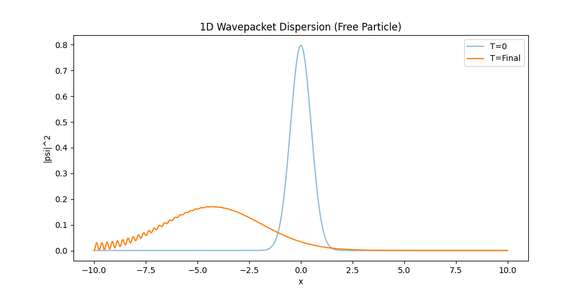
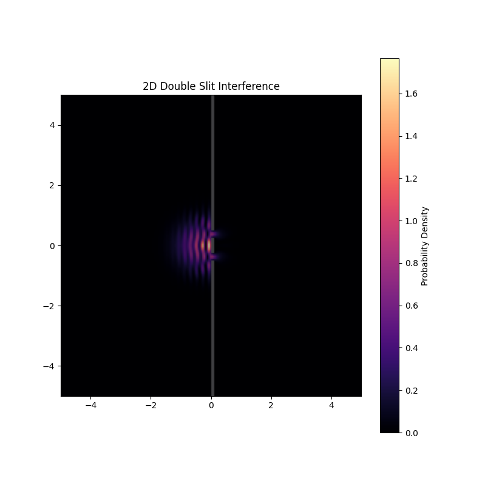
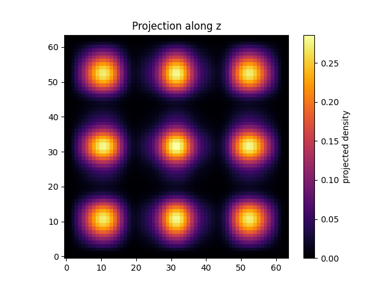
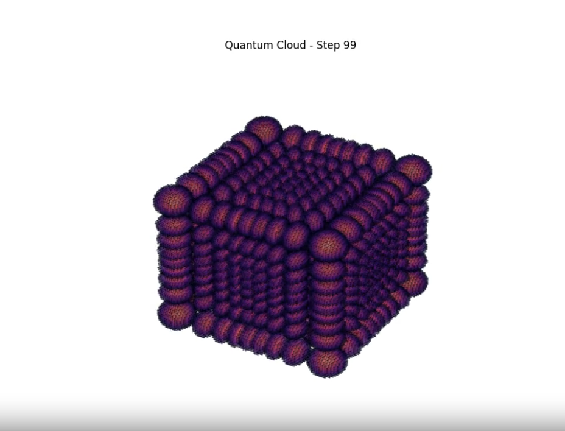

# QuantumCML: N-Dimensional Quantum Lattices
**From Local Rules to Global Waves**

`QuantumCML` is a high-performance simulation engine that models Quantum Mechanics not through global operators, but as a **Coupled Map Lattice (CML)**. By discretizing the Time-Dependent Schrödinger Equation (TDSE) into localized, nearest-neighbor interaction rules, it demonstrates how complex wave behavior emerges from a simple grid of cells.

Built with **PyTorch**, the engine leverages **GPU acceleration (CUDA)** to scale from 1D strings to dense 3D probability clouds.

## Key Features
*   **GPU Accelerated:** Uses PyTorch tensors to perform multi-dimensional Laplacian operations in parallel.
*   **Symplectic Stability:** Implements a semi-implicit "Offset Euler" integration scheme to ensure probability conservation without numerical drift.
*   **Dimension Agnostic:** The core solver uses recursive stencils, allowing the same logic to handle 1D, 2D, and 3D systems natively.
*   **Emergent Physics:** Successfully reproduces dispersion, interference (Double Slit), and 3D diffraction without hard-coded wave equations.

## How it Works: The Local Rule
Most quantum solvers act on the entire Hilbert space simultaneously. `QuantumCML` treats space as a grid where each cell $(i, j, k)$ holds a complex amplitude. The cell updates its state based solely on its immediate neighbors using a discrete Laplacian stencil:

$$\nabla^2\psi_{i,j,k} \approx \frac{\psi_{i+1,j,k} + \psi_{i-1,j,k} + \psi_{i,j+1,k} + \psi_{i,j-1,k} + \psi_{i,j,k+1} + \psi_{i,j,k-1} - 6\psi_{i,j}}{\Delta x^3}$$

By interleaving the updates of the Real and Imaginary components, the simulation maintains the unitary nature of quantum evolution.

## Visual Results

### 1D: Wavepacket Dispersion
Verification of the fundamental "spreading" of a Gaussian packet in free space.


### 2D: Double Slit Interference
The "Money Shot." A wavepacket is fired at a wall with two narrow slits. The resulting constructive and destructive interference fringes emerge naturally from the grid interactions.
| Initial Interference | Interference after reflection off walls |
|----------|----------|
|  |  |

### 3D: Probability Clouds
Scales the simulation to a $64 \times 64 \times 64$ voxel grid, visualizing the evolution of a 3D wavepacket contained within hard-walled boundaries.
| 3D Slice | 3D Plot |
|----------|----------|
|  |  |

## Usage

The engine is controlled via a simple command-line interface.

```bash
# Run 1D Calibration
python main.py 1

# Run 2D Double Slit Simulation
python main.py 2

# Run 3D High-Res Simulation (Requires GPU)
python main.py 3
```

## Dependencies
*   Python 3.8+
*   PyTorch (CUDA recommended for 3D)
*   Matplotlib
*   NumPy

---
*Created as a project for IDC621 - Modelling Complex Systems.*
